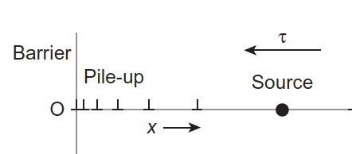
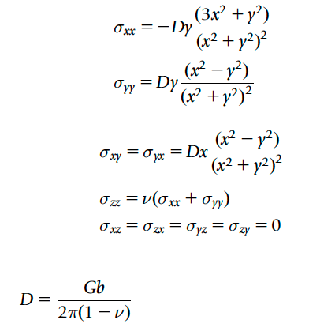
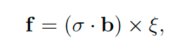
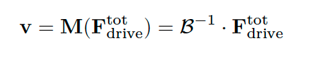

# Dislocation Pile-Ups Dynamic

## Dislocation Pile-Up
The dislocation pile-up is dislocation array that forms during plastic deformation. During that process, many dislocations are generated by Frank-Read source in the same slip plane. Ultimately, the leading dislocation will meet a barrier, e.g. grain boundary or sessile dislocation configuration and further prevent the expansion of dislocation loop. The dislocations the pile-up behind the leading dislocation, but due to the same sign, they are not combined each and separated by the spacing ruled by elastic theory, type of dislocation, and the external shear stress.  

*Dislocation pile-ups*

## Elasticity Theory of Edge Dislocation
The stress field aroud an edge dislocation can be represented by Volterra's cylinder construction and notice, the deformation of that cylinder is basically a plane strain, i.e. the displacement and strains in z-direction are zero.

*Stres field of edge dislocation. From Hull & Bacon, 2011, Chapter 4*

## Peach-Koehler Force
The force on a dislocation is the product of Burgers vector and stress components. This identity can be generalized by the force per unit length, f, at an arbitrary point, P. It is formulated by Peach-Koehler equation as follows
insert equation

*Peach-koehler force*

where σ is the local stress field and ξ is the local tangent direction (line sense) at point P. The cross product with ξ ensures that PK force is always perpendicular to the line.

The significance of the PK formula is that the force acting on dislocation is fully affected by the local stress field, σ, regardless the origin of this stress. In addition to the external forces, local stresses can be induced by other dislocations. The total stress is then a linear superposition of all such induced contributions

## Brief Concept Disrete Dislocation Dynamics (DDD)
The backbone of DDD simulation is the implementation elastic properties of dislocation. First, the initial configuration of the dislocation position, boundary condition, and loading conditions are to be input. Subsequently, the embedded-physics of dislocation is then formulated into a set of governing equations for the positions of a dislocation line network. The rest step of DDD simulation, apart from the initial confguration, is discretization of dislocation lines. Then, the calculation of force on each DOF uses the PK force. 

The mobility laws serve as constitutive equation in dislocation dynamics simulations, relating the total driving force per unit length acting on a dislocation line to its velocity. Mobility laws must be constructed within a specific material system since it is strongly material dependent. The viscous drag forces experienced by dislocation in crystalline solid, for instance the force induced by phonon dispersion, are often proportional to the dislocation velocity. Hence, the linear model can be written as

*Velocity of dislocation according to overdamped motion.*

## Simulation Model 
As explained in brief concept of DDD, the simplification of the problem is taken during the 2-D Pile-ups dynamics since we are dealing only with the point of dislocation. In the simulation model of Dislocation Pile-ups Dynamic, the dislocation lines are assumed to be parallel, straight, and have edge dislocation character. Under the pile-ups condition, the simulation is essentially one-dimensional having only one slip plane and the dislocation can only glide in one direction. Thus, no discretization step during the simulation and the DOF itself is a point assuming the position of dislocation.

Subsequently, the external force is accounted during the simulation. The temperature is assumed to be low, thus the climb may be neglected. The total force in the simulation consists of Peach-Koehler force, external force, and image force. Given the total force, dislocation will glide according to the dissipative motion equation (overdamped motion), resolving the dissipative motion of equation yields the dislocation velocity. Finally, the forward Euler formulation is computed.

